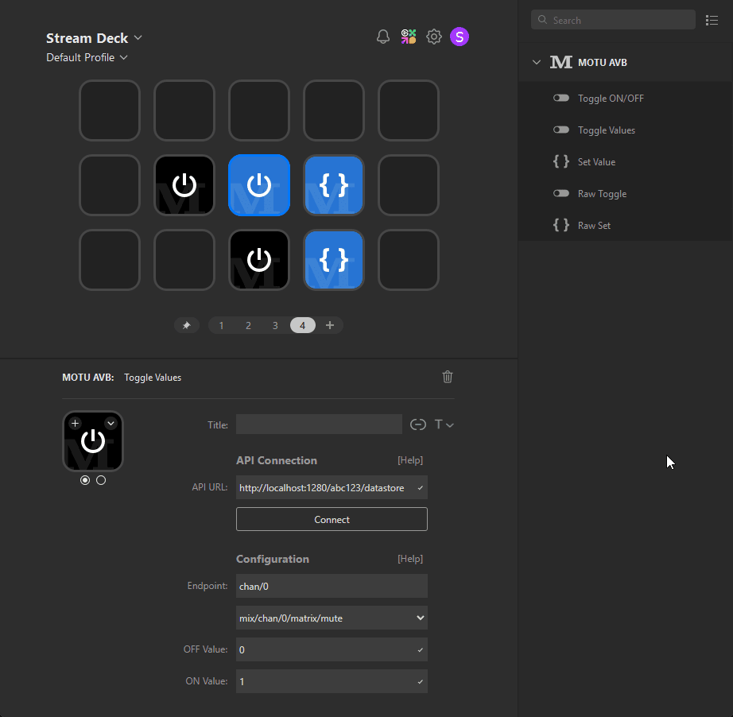

# MOTU AVB Plugin for StreamDeck (Unofficial)

Control your MOTU audio interface directly from your StreamDeck using the MOTU AVB Web API.

> This plugin is unofficial and not affiliated with MOTU, Inc.

Only interfaces compatible with the [MOTU AVB Datastore API](https://cdn-data.motu.com/downloads/audio/AVB/docs/MOTU%20AVB%20Web%20API.pdf) are supported.  
Tested with the **UltraLite AVB** — other AVB-enabled MOTU devices *may* work as well.



---

## 🎛️ Available Actions

### 🔁 Toggle ON/OFF

Switches a value between `0` and `1`.  
Useful for toggling **Mute**, **Solo**, or any other binary parameter.

### 🔁 Toggle Between Values

Switches between two user-defined values (e.g., `-3 dB` ↔ `0 dB`).  
Great for flipping faders or toggling specific "non-binary" settings.

### 🎯 Set Value

Sets a fixed value on a parameter with a single button press.  
(Not a toggle.)

> 💡 All actions come with a simple configuration UI, including help text. No setup on the MOTU interface is required.

---

### 📦 Installation

Download the `.streamDeckPlugin` file in the GitHub releases section and double-click to install.
StreamDeck will take care of the rest.

---

## 🧪 Development

Built with **Node.js v20.19.0**

```bash
npm install -g @elgato/cli
npm install
streamdeck link com.simonedenadai.motu-avb.sdPlugin
npm run watch
```

This links the plugin to your StreamDeck and enables live development with hot reload.

---

### ⚠️ Disclaimer

All product and company names are trademarks™ or registered® trademarks of their respective holders.
Use of them does not imply any affiliation with or endorsement by them.
